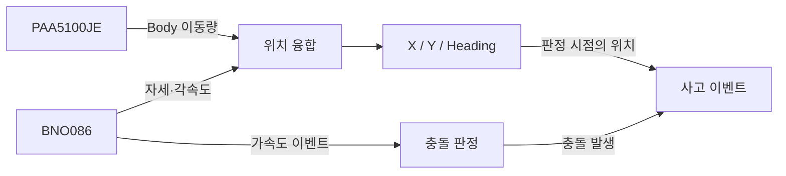

# BNO086 + PAA5100JE Sensor Fusion

**Raspberry Pi 기반 RC카의 상대 위치·방향 추정**

BNO086 IMU의 자세 정보와 PAA5100JE Optical Flow 센서의 바닥 이동량을 결합해 차량의 2D 위치를 추정한다. ACEteam 프로젝트에서 개발한 센서 모듈을 분리한 저장소로, C/pthread 구현과 Python 기준 구현, 실기기 진단 및 회귀시험을 함께 담고 있다.

[동작 구조](#동작-구조) · [빠른 시작](#빠른-시작) · [하드웨어와 설정](#하드웨어와-설정) · [실행과 보정](#실행과-보정) · [시험과 진단](#시험과-진단)

## 동작 구조

PAA5100JE의 이동량을 BNO086의 상대 Heading으로 회전한 뒤 누적한다. 가속도 이벤트는 별도 충돌 판정 경로에서 처리한다.



### 위치 융합

- **거리 환산** — Optical Flow의 `dx/dy tick`을 센서 높이와 실측 scaler로 환산한다: `distance_cm = ticks × height_cm / scaler`.
- **좌표 변환** — 이전·현재 Heading의 중간 방향을 사용해 차량 기준 이동량을 world 좌표로 변환하고 X/Y에 적분한다.
- **입력 품질 관리** — 작은 정지 진동은 deadband로 처리하고, 낮은 SQUAL이나 오래된 RV/Gyro 데이터는 위치 적분에서 제외한다.
- **회전 보정** — 센서가 차량 회전 중심에서 떨어져 생기는 이동량을 lever-arm calibration으로 학습해 감산한다.

시작 전 RV/Mag accuracy가 모두 2 이상인지 확인하고, 새로 수신한 quaternion으로 방향 기준을 잡는다. 운행 중 일시적인 accuracy 저하는 진단값으로 기록하고, report가 끊긴 stale 상태는 별도로 처리한다.

### 차량별 프로세스

| 프로세스 | 센서 | 역할 | IPC 목적지 |
|---|---|---|---|
| [`witness_sensor`](witness_sensor.c) | BNO086 | 고정 X/Y와 현재 Heading을 20 Hz로 전달 | Witness Filter |
| [`accident_sensor`](accident_sensor.c) | BNO086 + PAA5100JE | 이동 위치 추정 및 충돌 이벤트 생성 | P2P |

BNO I/O 스레드는 센서를 읽고 **최신 snapshot**과 **이벤트 ring**을 갱신한다. 위치 계산은 snapshot을, 충돌 판정은 독립 cursor로 가속도 이벤트를 읽는다. 사고차량의 IPC 송신은 별도 스레드와 bounded queue로 분리해 소켓 지연이 센서 수신을 막지 않도록 구성했다.

**충돌 판정은 기본 비활성 상태다.** Raw/Linear Acceleration, jerk, delta-V를 계산하는 판정기와 수집 도구가 구현되어 있으며, 실측 데이터로 `collision_config`의 지표·임계값을 설정한 뒤 활성화한다.

<details>
<summary>스레드 구성과 IPC 인터페이스</summary>

| 담당 | 관찰차량 | 사고차량 |
|---|---|---|
| BNO I/O | SH-2 수신, feature 설정, snapshot/event 갱신 | 동일 |
| Main | 상대 Heading 계산, 상태 IPC 송신 | PAA 읽기, 위치 융합, 위치 상태 갱신 |
| Collision | — | 가속도 이벤트 소비, 충돌 판정 |
| IPC Sender | — | 사고 이벤트 queue 소비, P2P 재연결·송신 |

| 프로세스 | 소켓 | 메시지 | Payload |
|---|---|---|---|
| `witness_sensor` | `/tmp/witness_sensor.sock` | `IPC_MSG_SENSOR_DATA` | `vehicle_state_t` |
| `accident_sensor` | `/tmp/p2p.sock` | `IPC_MSG_ACCIDENT_EVENT` | `accident_event_payload_t` |

충돌 판정은 여러 지표가 설정 시간창 안에서 함께 임계값을 넘는지 확인한다. 검출 후에는 latch, cooldown, quiet rearm으로 같은 충격의 중복 이벤트를 억제한다. Event ring에서 sample을 놓치거나 BNO generation이 바뀌면 jerk/delta-V 이력을 초기화한다.

</details>

## 빠른 시작

### 핵심 모듈 시험

Linux의 C11 컴파일러, `make`, pthread/libm을 사용한다. 센서 연결 없이 핵심 C 모의시험을 실행할 수 있다.

```bash
git clone https://github.com/kingwooseok/sensorfusion_bno086_paa5100je.git
cd sensorfusion_bno086_paa5100je
make check-core
```

Raspberry Pi OS에서 개발 도구와 Python 시험 의존성을 준비하려면 다음을 실행한다.

```bash
sudo apt install build-essential python3-lgpio python3-spidev
make check-python
```

### 차량 프로세스 빌드

차량 프로세스는 ACE 프로젝트의 IPC 모듈을 함께 빌드한다. `ipc.c`, `ipc.h`, `protocol.h`, `p2p_protocol.h`, `sensor_protocol.h`가 있는 디렉터리를 지정한다.

```bash
make ACE_IPC_DIR=/path/to/2026ESWContest_mobility_ACE/ipc all
```

기본 경로는 `../2026ESWContest_mobility_ACE/ipc`이며, 해당 위치에 IPC 소스가 있으면 `make all`로 빌드할 수 있다. 결과물은 `witness_sensor`, `accident_sensor`다.

## 하드웨어와 설정

### 센서 연결

| 센서 | 항목 | 기본값 |
|---|---|---|
| BNO086 | I2C 장치 / 주소 | `/dev/i2c-1` / `0x4B` |
| BNO086 | H_INTN / Reset | GPIO line 18 / 23, active-low |
| PAA5100JE | SPI 장치 | `/dev/spidev0.1` — CE1 |
| PAA5100JE | SPI mode / clock | Mode 3 / 2 MHz |
| PAA5100JE | 물리 핀 | MOSI 19 · MISO 21 · SCLK 23 · CE1 26 |

Raspberry Pi에서 I2C/SPI를 활성화하고 실행 계정에 `/dev/i2c-1`, `/dev/gpiochip0`, `/dev/spidev0.1` 접근 권한을 부여한다. GPIO line 번호와 커넥터의 물리 핀 번호는 구분한다.

<details>
<summary>센서 report와 드라이버 처리</summary>

사고차량은 Rotation Vector, Gyroscope, Accelerometer, Linear Acceleration을 각각 100 Hz로, Magnetometer를 50 Hz로 요청한다. 관찰차량은 Rotation Vector와 Magnetometer만 사용한다. 드라이버는 feature 응답의 실제 interval과 sensor report 수신을 함께 확인한다.

PAA5100JE는 Product ID `0x49`와 inverse ID `0xB6`을 확인한다. Register read와 motion burst는 주소·데이터 구간을 하나의 `SPI_IOC_MESSAGE(2)`로 전송해 turnaround delay 동안 hardware CS를 유지한다.

</details>

### 거리 보정값

처음 실행하기 전에 예제를 복사한다. `cp -n`은 기존 설정을 유지한다.

```bash
cp -n config.example.json config.json
```

[`config.example.json`](config.example.json)의 값:

```json
{
    "height_cm": 2.3,
    "scaler": 385.98995803
}
```

`height_cm`는 렌즈와 바닥 사이 높이, `scaler`는 tick을 거리로 환산하는 실측값이다. 실제 장착 높이와 주행면에 맞게 보정하며, 사고차량의 시작 메뉴에서 변경하면 실행 파일 옆의 `config.json`에 저장된다. 이 파일은 Git에서 제외된다.

### 테스트베드 좌표

위치 융합 내부는 **cm**, IPC로 전달하는 테스트베드 위치는 **mm**를 사용한다. 테스트베드 Heading은 **0° = +Y**, **90° = +X**이며 시계방향으로 증가한다.

| 설정 위치 | 상수 | 의미 |
|---|---|---|
| `witness_sensor.c` | `WITNESS_FIXED_X_MM`, `WITNESS_FIXED_Y_MM` | 관찰차량의 고정 위치 |
| `witness_sensor.c` | `WITNESS_INITIAL_HEADING_DEG`, `WITNESS_RELATIVE_HEADING_SIGN` | 초기 방향과 Heading 부호 |
| `accident_sensor.c` | `ACCIDENT_START_X_MM`, `ACCIDENT_START_Y_MM` | 사고차량의 출발 위치 |
| `accident_sensor.c` | `ACCIDENT_START_HEADING_DEG`, `ACCIDENT_RELATIVE_HEADING_SIGN` | 초기 방향과 Heading 부호 |
| `accident_sensor.c` | `ACCIDENT_FUSION_TO_TESTBED_DEG` | 융합 좌표를 테스트베드 좌표로 회전하는 각도 |

차량 위치와 장착 방향에 맞춰 상수를 설정한 뒤 빌드한다.

## 실행과 보정

### 관찰차량

```bash
./witness_sensor
```

1. BNO086 초기화 후 센서를 여러 축으로 천천히 움직여 RV/Mag accuracy를 모두 2 이상으로 맞춘다.
2. 차량을 설정된 초기 방향에 놓고 Enter를 누른다. Enter 이후의 새 quaternion이 상대 Heading 0° 기준이 된다.
3. 고정 X/Y와 Heading을 Witness Filter로 전송한다. 연결이 없으면 0.5초 간격으로 재연결한다.

BNO reset, startup loss, RV/Mag stale이 발생하면 송신을 멈추고 방향 기준을 다시 설정한다.

### 사고차량

```bash
./accident_sensor
```

| 시작 메뉴 | 동작 |
|---|---|
| `Enter` / `1` | 저장된 height/scaler로 시작 |
| `2` | 알려진 이동 거리로 scaler 보정 |
| `3` | 센서 높이 변경 |

메뉴 선택과 BNO 보정 후에는 Heading 방향을 확인한다. 출발 자세에서 차량을 **반시계방향으로 약 90°** 돌려 `+90° ±15°`를 확인하고, 원래 방향으로 돌아와 `0° ±15°`를 확인한다. 복귀 시점의 fresh quaternion으로 기준을 다시 잡고 PAA 누적 이동량을 비운 뒤 위치 적분을 시작한다.

| 운행 중 입력 | 동작 |
|---|---|
| `r` | 위치 원점과 가능한 경우 fresh Heading 기준 재설정 |
| `c` | Lever-arm calibration 시작 / 종료 시도 |
| `q` 또는 `Ctrl-C` | 종료 |

<details>
<summary>Lever-arm calibration 순서</summary>

1. `c`를 눌러 보정을 시작한다.
2. 차량을 제자리에서 시계·반시계 양방향으로 회전시킨다.
3. 다시 `c`를 누르면 표본 수와 양방향 조건을 확인하고 보정값을 적용한다.

보정 중에는 PAA를 계속 읽되 좌표에 적분하지 않는다. 종료 시 Heading 기준을 이어 붙이고 마지막 PAA delta를 비워 정상 주행으로 복귀한다.

</details>

## 시험과 진단

| 명령 | 확인 범위 | 준비 사항 |
|---|---|---|
| `make check-core` | 위치 융합, PAA SPI, BNO 모의시험, 충돌 수집기 self-test | C 빌드 환경 |
| `make check-python` | Python 융합 수학, 위치 pipeline, SPI protocol | Python 3, `lgpio`, `spidev` |
| `make check-c` | 핵심 C 시험 + 차량 프로세스·IPC 모의시험 | C 빌드 환경, 외부 ACE IPC |
| `make check` | 전체 C/Python 회귀시험 | 위 C/Python 의존성 |
| `make bno-test-hw` | BNO086 실기기 진단 실행 파일 빌드 | C 빌드 환경 |
| `make paa-roundtrip-test` | PAA 전진·후진 raw tick 비교 | C 빌드 환경, PAA5100JE |

IPC가 기본 경로에 없으면 빌드 때와 같이 `ACE_IPC_DIR`을 지정한다. 실기기 시험은 같은 센서를 사용하는 차량 프로세스를 종료한 뒤 실행한다.

<details>
<summary>BNO086 스트리밍 진단</summary>

```bash
make bno-test-hw
/tmp/test_bno086_c_hw feature 10
/tmp/test_bno086_c_hw stability 60
/tmp/test_bno086_c_hw accel 30
```

각각 feature 설정 10회 반복, 자세·각속도·자기장 60초 수신, Raw/Linear Acceleration 30초 수신을 확인한다. Bus 오류와 SHTP 검증 오류, Phase-2 null header의 재읽기 성공·실패를 구분해 출력한다.

</details>

<details>
<summary>PAA5100JE 왕복 측정</summary>

```bash
make paa-roundtrip-test
```

같은 직선을 전진한 뒤 **차체 방향을 바꾸지 않고 후진**해 시작점으로 돌아온다. 두 구간의 raw `dx/dy`를 직접 비교하므로 BNO Heading과 scaler의 영향을 분리해 볼 수 있다.

`actual_return`과 `expected_return=-outbound`를 비교하고, `uncancelled`, `raw_tick_closure_error`, SQUAL, read 간격을 함께 확인한다.

</details>

<details>
<summary>충돌 데이터 수집과 임계값 설정</summary>

```bash
gcc -std=c11 -Wall -Wextra -Wpedantic -Wshadow -Wconversion -Werror \
    -I. test_collision_capture.c bno086.c -pthread -lm \
    -o test_collision_capture
./test_collision_capture --self-test
./test_collision_capture --session rc_test_01
```

정지·가속·제동·선회 등 정상 주행과 완충재를 사용한 저속 충돌을 구분해 수집한다. 기록 중 Enter는 trial 종료, `m` + Enter는 충돌 순간 표시, `q` + Enter는 trial 취소다.

기록 후 데이터를 검토해 승인·재분류·폐기하며, 결과는 `collision_captures/<session>/`의 CSV로 저장된다. 같은 session 이름으로 이어서 수집할 수 있다. 수집 결과를 바탕으로 `accident_sensor.c`의 `collision_config`에 지표 조합, 임계값, 시간창, cooldown/rearm 조건을 반영한다.

</details>

## 파일 구성

| 파일 | 역할 |
|---|---|
| [`bno086.c`](bno086.c), [`bno086.h`](bno086.h) | BNO086 SH-2/SHTP I2C 드라이버, snapshot/event ring |
| [`paa5100je.c`](paa5100je.c), [`paa5100je.h`](paa5100je.h) | PAA5100JE Linux spidev 드라이버 |
| [`position_fusion.c`](position_fusion.c), [`position_fusion.h`](position_fusion.h) | 상대 Heading, 좌표 변환, 위치 적분, lever-arm 보정 |
| [`witness_sensor.c`](witness_sensor.c), [`accident_sensor.c`](accident_sensor.c) | 차량별 센서 프로세스와 IPC 연동 |
| [`test_collision_capture.c`](test_collision_capture.c) | 실기기 가속도·충돌 데이터 수집 |
| [`scratch/`](scratch/) | C/Python 회귀시험과 센서 진단 도구 |
| [`bno086.py`](bno086.py), [`pmw3901.py`](pmw3901.py), [`read_flow.py`](read_flow.py), [`calibrate.py`](calibrate.py) | C 이식의 기준이 된 Python 구현과 보정 도구 |
| [`Makefile`](Makefile), [`config.example.json`](config.example.json) | 빌드·시험 명령과 거리 보정 설정 예제 |

Python의 `pmw3901.py` 파일명은 기존 구현과 시험 호환성을 위해 유지한다.

## 실측 메모

RC카 왕복 시험에서는 저속에서 PAA raw tick이 비교적 잘 상쇄됐지만, 속도가 높아지면 같은 거리에서도 tick 합계와 왕복 대칭성이 달라졌다. 당시 바닥·높이·조명 조건에서는 약 30 cm/s 부근부터 오차가 커지는 양상이 관측됐다. 이후 ACE 프로젝트의 위치 추정은 ArUco 방식으로 전환했으며, 이 저장소에는 Optical Flow 기반 융합 구현과 진단 도구를 정리했다.
